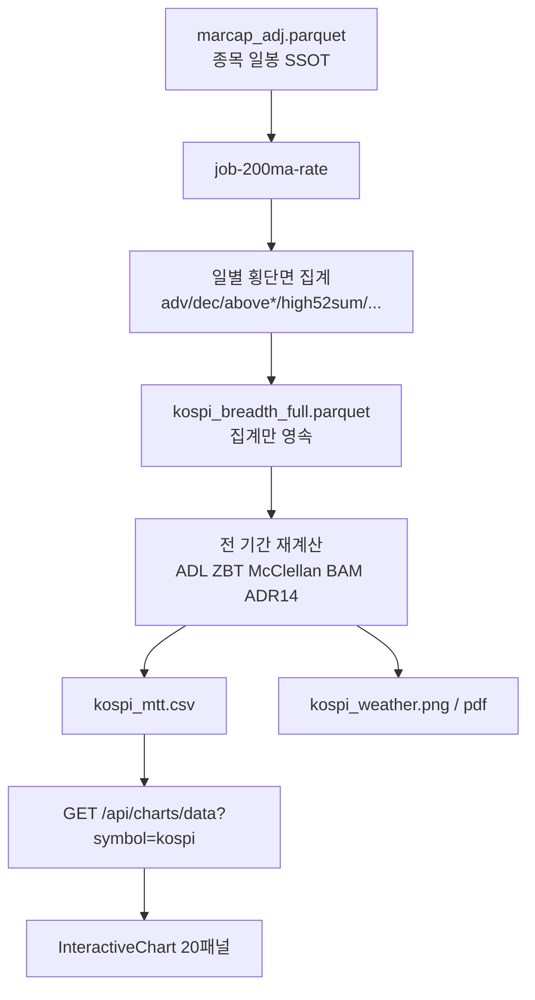

# KOSPI Weather 전기간 심층지표분석 & 웹 1:1 대화형 차트 시스템 설계서 (v3.3)

> **변경 이력 (v3.2 → v3.3)** — 실전 운영 미세 점검 (아키텍처 불변, Phase 구현 계약)
> - **§2.2** 상폐 이후 `ts_fill_suspension` ffill 차단 (분모·유니버스 오염)
> - **§5.3** USD/KRW: XKRX 일자축 reindex + `ffill().bfill()` (한·미 휴장 교차 결측)
> - **§8.2 / §9.2** 집계 Int64 CSV 정수 포맷, NaN→float64 캐스팅 방어
> - **§9.1** 20패널 `ResizeObserver` **100ms debounce**
>
> **변경 이력 (v3.1 → v3.2)** — 금융·파이썬 전문가 리뷰 반영
> - **증분 불변조건**: compute window ≠ upsert window. 52주 lookback **260 trading days**. 파생지표는 Parquet 원천으로 쓰지 않음
> - **유니버스 계약**: 동일가중 KOSPI+KOSDAQ 보통주. ADL/McC Sum **시대 레벨 비교 금지**
> - **지표 공식 카드**: ZBT/McClellan/BAM/ADR14 단위·원전 차이·임계선 의미
> - **BAM axvline**: 전기간 전일 표시 금지 → visible range 또는 1.8 상향 돌파만
> - **단일 계산 경로**: VIX Fix / RSI / MACD / SMA — PNG와 웹이 같은 값
> - API `None→0.0` / `round(..., 2)` 금지 (ZBT·BAM 신호 왜곡)

---

## 1. 개요 (Overview)

본 문서 (`v3.3`)는 `imarcap` 마스터 배치 파이프라인 원소스([`~/workspace/git/marcap/imarcap/src/imarcap/jobs/200ma_rate_pl.py`](file:///Users/hosung/workspace/git/marcap/imarcap/src/imarcap/jobs/200ma_rate_pl.py))가 생성하는 **KOSPI Weather (`kospi_weather.png`, `kospi_mi.pdf`)**와 `mtt-trend` **「심층지표 분석」** 차트를 **ax1~ax20 1:1**로 맞추고, **1995년~현재** 브레스를 **증분 갱신**하되 **rolling 윈도우가 캐시를 오염시키지 않게** 하는 통합 명세서입니다.

### 1.1. 설계 원칙

| 원칙 | 내용 |
|------|------|
| **Master 파이프라인 SSOT** | 유일한 권위 파이프라인 원소스는 **`~/workspace/git/marcap/imarcap/src/imarcap/jobs/200ma_rate_pl.py`** |
| **PNG = Web 화면 SSOT** | ax1~ax20 순서·오버레이·기준선 1:1. 값은 **동일 계산 경로** |
| **Breadth 일별 집계 SSOT** | Parquet에는 **횡단면 일별 집계만**. `adl`/`ZBT`/`mcclellan_*`는 매 런 전체 재계산 |
| **Web export** | `kospi_mtt.csv` = KOSPI OHLCV + 집계 + 재계산 파생 + MMT + KS/KQ Amount·Volume |
| **하위 호환** | CLI·크론·Discord 100% 유지 |
| **정직한 해석** | 누적 레벨 지표는 유니버스 팽창에 묶여 있다. 문서·UI에 경고 |

### 1.2. 범위

| In | Out |
|----|-----|
| PNG 20패널 웹 재현 | KOSPI200/KOSDAQ 전용 웹 breadth (별도 SPEC) |
| Parquet 증분 + 불변조건 | `macro.db` / `stockbee_mm.db` |
| `GET /api/charts/data?symbol=kospi` | PNG에 없는 `disparity_sma50`, `adr20` 패널 |

### 1.3. 출시 게이트 (이 4개가 문서+코드+테스트에 없으면 전기간 차트 비공개)

1. Incremental이 **warm-up 구간을 캐시에 덮어쓰지 않는다** (회귀: 1년 전 `high52sum`/`adl` ≡ `--rebuild`).
2. Compute lookback ≥ **260 trading days**.
3. ADR14(중립 100)와 BAM(중립 1.0) 단위가 웹 축·툴팁에 명시.
4. API가 ZBT/BAM/ADL 결측을 `0.0`으로 넣지 않는다.

---

## 2. 유니버스 계약 (Breadth Universe)

브레스는 **시총 가중이 아니다.** 삼성전자와 소형주가 한 표씩이다. 그것이 브레스의 존재 이유다.

| 항목 | 계약 |
|------|------|
| 시장 | `Market ∈ {KOSPI, KOSDAQ}` (`" GLOBAL"` 접미사 제거 후) |
| 종목 | `Code` 끝자리 `0` (보통주). 우선주(5/7/9 등) 제외 |
| 제외 | 스팩 (`스팩\|호스팩\|.*\d+호$`) |
| 가중 | **동일가중** (종목 수 / 비율) |
| 가격 | `marcap_adj` 수정주가. 거래정지 구간은 `ts_fill_suspension` 후 `pct_change`. **상폐일 이후는 ffill 금지** (§2.2) |
| 상폐 | `marcap_adj`에 **상폐 종목이 남는 한** 상폐 **당일까지** 유니버스에 포함. 남기지 않으면 1997·2000·2008 브레스는 생존 편향 |
| 변동 없음 | `Chg.sign()`이 0인 종목은 adv/dec에 **불포함** (Zweig 관행과 동일) |

### 2.1. 시대 비교 금지

| 지표 유형 | 예 | 1998 vs 2026 절대레벨 |
|-----------|-----|------------------------|
| **비율** | Above MA %, ZBT, BAM, ADR14 | 비교 **가능** (분모가 당일 유니버스) |
| **누적 레벨** | ADL, McClellan Summation | **비교 금지** — 상장 수 팽창 + cumsum 경로의존 |
| **원숫자 오실레이터** | McClellan Osc (`EMA(adv-dec)`) | 진폭이 유니버스와 함께 커짐. ±100 밴드는 **최근 구간에만** 익숙한 눈금 |

- 코스닥 개장 **1996-07**. 그 이전 합산 브레스는 사실상 코스피.
- 상장 종목 ~700 → ~2,400+. Saito 기준선 100, McClellan ±100은 **보정하지 않은 역사적 눈금**이다.
- 웹: ADL / McC Sum 패널에 고정 문구 — `레벨은 상장 수·시작일에 의존. 기울기만 볼 것.`

### 2.2. 상폐 이후 ffill 차단 (HARD — Phase 1)

`ts_fill_suspension`은 거래정지 구간의 가격·주식수를 forward-fill한다. 상폐 종목이 `marcap_adj`에 **마지막 거래일 이후 행 없이**만 있으면 문제 없다. 그러나 상폐 후에도 날짜 그리드가 이어지거나, ffill이 종목의 **수명 밖**까지 채워지면:

- 분모(`pl.count()` / 상장 종목 수)에 유령 종목이 남아 Above MA %가 낮아진다
- `adv`/`dec`에 0 변화(또는 정지 해제처럼 보이는 가짜 Chg)가 섞인다
- 상폐일 이후 `Stocks`/`Marcap` ffill은 시가총액·대금 조건(Stockbee `vol_cond`)을 왜곡한다

**계약**

1. 종목별 **유효 종료일** `last_valid_date(Code)` = 해당 코드의 SSOT **마지막 실거래 행** (또는 별도 상폐일 마스터가 있으면 그 날짜).
2. `ts_fill_suspension` **전 또는 직후**, `Date > last_valid_date` 행은 **drop**. ffill 대상에서 제외.
3. 보조 가드: 상폐 확정 구간에서 `Volume == 0`만으로 자르지 않는다 (정지와 구분 불가). **수명 컷이 1차**, Volume=0은 로그만.
4. 회귀: 알려진 상폐 종목 1개에 대해 상폐일 **다음 KRX 영업일**이 집계 유니버스에 **0건**.

---

## 3. 데이터 아키텍처 및 SSOT 계층



> `macro.db`, `stockbee_mm.db`는 본 SPEC 밖.

### 3.1. 저장소

| 계층 | 경로 | 저장 내용 | Writer | Reader |
|------|------|-----------|--------|--------|
| **파이프라인 원소스** | `~/workspace/git/marcap/imarcap/src/imarcap/jobs/200ma_rate_pl.py` | 지표 연산·시각화 마스터 로직 | Developer | `job-200ma-rate` |
| 종목 SSOT | `~/.cache/db/marcap_adj.parquet` | 수정 OHLCV | imarcap pipeline | `200ma_rate_pl.py` |
| **Breadth 집계** | `~/.cache/db/kospi_breadth_full.parquet` | **일별 횡단면만** (§8.1) | `200ma_rate_pl.py` | 동 잡 (재계산 입력) |
| Web export | `~/.cache/db/kodex_leverage/kospi_mtt.csv` | OHLCV + 집계 + 파생 + MMT + KQ Amt/Vol | `200ma_rate_pl.py` | `chart_utils.py` |
| MMT 원본 | `mmt_all_count.log` (imarcap CWD) | MMT, Stocks | `job-kospi-mmt` 등 | `200ma_rate_pl.py` |
| PNG/PDF | `kospi_weather.png`, `kospi_mi.pdf` | 20패널 리포트 | `200ma_rate_pl.py` | Discord |

파생 컬럼(`adl`, `ZBT`, `bam`, `ADR14`, `mcclellan_*`, `stockbee_mm`)을 Parquet에 써도 **다음 런의 입력으로 사용하지 않는다.** 읽기 시 무시하고 집계 컬럼에서 재계산한다.

### 3.2. CSV Multi-Writer

| Writer | 스케줄 | 범위 | breadth 파생 |
|--------|--------|------|----------------|
| **`job-200ma-rate`** | 평일 18:05 | 전기간 export | **owner** |
| above10ma 실시간 | 장중 15분 | 당일 upsert | **금지** — OHLCV + `SMA*_pct` + ADR14/20만 |
| `imarcap_mtt_rebuild.sh` | 화~토 05:30 | 최근 10봉 | **금지** — 기존 breadth 열 보존 |

#### 3.2.1. Atomic Swap (Phase 1 TODO)

`path.tmp` write → `os.replace(path.tmp, path)`. 현재는 `to_csv(path)` 직접 쓰기.

#### 3.2.2. Staging 분리 (Phase 1 TODO)

`--staging` 시 입력 SSOT는 이미 staging. 출력도 `kospi_breadth_full_staging.parquet`, `kospi_mtt_staging.csv`로 분리. **현재는 prod 경로 공유 → 오염 가능.**

---

## 4. 증분 갱신 — 불변조건 (HARD)

### 4.1. Compute window ≠ Upsert window

| 단계 | 규칙 |
|------|------|
| **Compute** | SSOT를 `[end_date - L, end_date]`로 로드해 종목별 rolling 계산. L ≥ **260 trading days** (구현은 거래일 카운트 우선. 폴백 시 **400 calendar days**) |
| **Upsert** | 집계 결과 중 **`Date > last_cached_date`만** Parquet에 병합. 당일 수정주가 정정이 필요하면 `Date >= last_cached_date` |
| **Warm-up 폐기** | `Date <= last_cached_date`인 delta 행은 **버린다.** `keep="last"`로 1년치를 덮어쓰지 않는다 |
| **파생 재계산** | 병합된 **전체** 집계에 대해 `cumsum` / `ewm` / `rolling` 파생을 매 런 재계산 |

한국 연간 ~248 거래일. **365 calendar ≈ 248 거래일 < 250(52주).** v3.1의 365일은 52주를 **채우지 못한다.**

`ts_max(..., min_samples=1)` 때문에 warm-up 초반에는 전 종목이 52주 신고가로 잡힌다. 이 구간을 캐시에 쓰면 `high52sum`이 붕괴하고, 그 `adv`/`dec` 오차는 `adl` cumsum으로 **영구 전파**된다.

### 4.2. 회귀 테스트 (Phase 1 필수)

| ID | 내용 |
|----|------|
| `inc_no_overwrite_warmup` | incremental 후 `Date < last_cached_date`의 `high52sum`,`adv`,`above200ma_pct` ≡ 직전 캐시 |
| `inc_vs_rebuild_tail` | 신규 1~5일의 집계 ≡ `--rebuild` 동일 일자 |
| `inc_vs_rebuild_adl` | 전 기간 `adl` / `mcclellan_summation_indicator` max abs rel error < 1e-9 |
| `lookback_52w` | compute 구간의 첫 유효 52주 날짜가 upsert 날짜보다 **앞**인지 (윈도우 충족) |
| `delist_no_ffill` | 상폐 종목이 상폐일 다음 XKRX 영업일 집계에 **미포함** (§2.2) |

### 4.3. Cache hit

집계 SSOT 재연산만 skip. 파생은 집계에서 재계산(저비용). **KRX 전기간 fetch + yfinance + matplotlib dpi=300 + CSV는 현재도 실행** → E2E는 초 단위가 아님.

지수 OHLCV 로컬 캐시는 Phase 2 검토 (`--skip-png`, `--skip-export` 포함).

### 4.4. SLA (실측 전 목표)

| 구간 | 작업 | 목표 |
|------|------|------|
| A | Parquet 집계 load + 파생 재계산 | 1–3초 |
| B | A + index fetch + PNG + CSV | 30초–2분 |
| C | 260d compute + upsert + B | 1–5분 |
| D | 1995~ `--rebuild` + B | 10–30분 |

---

## 5. 지표 공식 카드

원전 변형이다. 웹 임계선은 **이 파이프라인의 정의**로만 해석한다.

### 5.1. 일별 집계 (Parquet에 영속)

| 컬럼 | 정의 |
|------|------|
| `above{N}ma_pct` | Close > SMA(N) 인 종목 수 / 당일 종목 수 × 100. N∈{10,20,40,50,200} |
| `high52sum` | `High >= rolling_max(High, 250) - 1e-8` 종목 수 |
| `low52sum` | `Low <= rolling_min(Low, 250) + 1e-8` 종목 수 |
| `adv` / `dec` | `sign(pct_change(Close))` = +1 / −1 인 종목 수. 0은 제외 |
| `saito_ratio` | **이름과 달리 개수.** `disp5≤90 AND disp25≤75` 종목 수. `dispN = Close/SMA(N)×100` |
| `q_bull` / `q_bear` / `d_bull` / `d_bear` | Stockbee 65일·34일 채널 ±25%/±13% + 대금조건 (`sma20×vol20 ≥ 250_000`) |

### 5.2. 매 런 재계산 파생 (Parquet 원천 금지)

| 컬럼 | 공식 | 단위 / 중립 | 원전과의 차이 | 임계선 의미 |
|------|------|-------------|---------------|-------------|
| `net_advances` | `adv - dec` | 종목 수 | — | — |
| `adl` | `cumsum(net) + 50000` | 오프셋 레벨 | +50000은 시각용 | **레벨 비교 금지.** 기울기만 |
| `mi` | `rolling_sum(net, 200)/200` | 종목 수 | — | PNG 미사용 가능 |
| `ADR14` | `sum_14(adv)/sum_14(dec) × 100` | **% , 중립 100** | — | 120 / 60 |
| `bam` | `sum_10(adv)/sum_10(dec)` | **비율, 중립 1.0** | PNG 라벨 ADR10 | 1.8 / 0.5. **ADR14와 단위가 다름** |
| `stockbee_mm` | `(q_bull>q_bear) + (d_bull>d_bear)` | 0,1,2 | Bonde 변형 | 2 bull / 0 bear shading |
| `ZBT` | `rolling_mean_10( adv/(adv+dec) )` | 0–1 | Zweig 원전은 보통 **10일 EMA** + 10일 내 0.40→0.615 **이벤트** | 여기는 **레벨 모니터.** 0.615 위 = 강세 구간이지 Thrust 발생 아님 |
| `mcclellan_oscilator` | `EMA19(net) - EMA39(net)`, `ewm(adjust=False)` | 원숫자 | 원전은 종종 `(A-D)/(A+D)×1000` | ±100 fill은 최근 유니버스 눈금. 상장 증가 시 상시 돌파 가능 |
| `mcclellan_summation_indicator` | `cumsum(osc)` | 누적 | 초기값 0 | **레벨 비교 금지** |
| `MMT` / `MMT_R` | 로그 `MMT`, `MMT/Stocks×100` | 개수 / % | — | 100 / 5.0. 로드 실패 시 **0이 아니라 null** |
| `vix_fix` | `(HHV(Close,22) - Low) / HHV(Close,22) × 100` | % | Williams | — |
| `vix_fix_fear` | `vix_fix` if `vix_fix > MA22+2σ` else 0 | % | — | Fear 영역만 막대 |

### 5.3. 지수 지표 (KOSPI 시계열)

`SMA50/150/200`, `RSI_14`, `MACD_12_26_9`, `MACDh_12_26_9`.

**USD/KRW (`KRW=X`)** — 오버레이 용. 서울 외환 고시와 다를 수 있음. Yahoo 시계열은 **뉴욕 캘린더**라서 **한국만 열고 미국이 쉬는 날**(추수감사절, 성탄절, 독립기념일 등) 종가가 NaN이다. 단순 `merge` + `ffill()`만 하면 (1) 시리즈 **첫날**이 미국 휴일이면 앞이 비고 (2) XKRX 축에 없는 주말 행이 남거나 한국 영업일이 빠질 수 있다.

**계약 (Phase 1)**

1. KOSPI 지수 날짜축 = **XKRX 영업일** (`exchange-calendars` `XKRX`, 또는 `get_kospi` 인덱스를 캘린더로 사용).
2. `usdkrw.reindex(kospi.index)` 후 `ffill().bfill()`. `bfill`은 **선두 결측 전용**이며 미래 환율을 과거로 끌어오지 않도록, reindex 이후 한 번만 적용.
3. 병합 후 `USD/KRW`가 한국 영업일에 전부 null이면 로그 warning + 해당 시리즈 미표시 (가짜 0 금지).

**단일 계산 경로:** PNG와 웹이 같은 숫자를 쓴다.

| 지표 | 계산 위치 | 웹 |
|------|-----------|-----|
| 브레스 파생 | `200ma_rate_pl.py`만 | CSV 컬럼 읽기. 백엔드 재계산 **금지** |
| SMA50/150/200, RSI, MACD | imarcap `attach_index_ta_indicators_pandas` → CSV | CSV 컬럼 사용. `chart_utils` Polars RSI/MACD/SMA **KOSPI 심볼에서는 끄기** |
| VIX Fix | imarcap에서 계산해 CSV 컬럼으로 export **또는** 공유 함수 한 곳 | 이중 구현 금지 |

### 5.4. BAM 세로선 밀도

PNG 원본은 최근 수년에서 `bam >= 1.8` **모든 날짜**에 axvline.

전기간 ~7,500일이면 상승 국면마다 선이 겹쳐 읽을 수 없다.

| 모드 | 규칙 |
|------|------|
| PNG `--days`로 짧은 구간 | 기존: `bam >= 1.8` 전일 (하위 호환) |
| PNG 전기간 / 웹 | **(A)** visible range 안의 날짜만 **또는 (B)** `bam`이 1.8을 **하향에서 상향 돌파한 날만** |
| 웹 기본 | **(B) 돌파만.** 툴팁에 유지 구간 여부 표시 가능 |

---

## 6. 하위 호환 CLI

`uv run imarcap job-200ma-rate` 파라미터·PNG·Discord 100% 유지.

| 파라미터 | 상태 | 동작 |
|----------|------|------|
| `--alert` / `--date` / `--output` / `--staging` | 기존 | 동일. staging **출력 분리**는 Phase 1 |
| `--rebuild` | 신규 | 집계 캐시 무시, 전기간 재연산 |
| `--days` / `--start-date` | 신규 | PNG 시각화 구간만. 집계 SSOT 범위가 아님 |

휴장일 `holiday.txt` 평일 스킵, 종료 코드, 로그 포맷: `CRONTAB_SETUP.md`.

---

## 7. PNG ↔ Web 1:1 패널 (ax1 ~ ax20)

PNG에 없던 `disparity_sma50`, `adr20` 패널 **없음.**

| PNG | Web ID | 구성 | 시리즈 | 기준선 / 주의 |
|-----|--------|------|--------|----------------|
| ax1 | `main` | OHLC + SMA50/150/200 + USD/KRW + stockbee shading | Candle + Line×3 + USD secondary. **Volume 없음** | SMA50 R, 150 B, 200 G. mm=2 red α0.12, mm=0 blue α0.08 |
| ax2 | `stockbee_mm` | MM + above40ma_pct (T2108) | Baseline + Line secondary | MM baseline 1; 40MA 20/70 |
| ax3 | `high52_low52` | 52W 고/저 **area** | Area×2 | Low는 음수 표시 |
| ax4 | `bam` | BAM | Line + fill | **중립 1.0.** 1.8 / 0.5 |
| ax5 | `adr14` | ADR14 **단독** | Line + fill | **중립 100.** 120 / 60 |
| ax6 | `high52_low52_net` | High−Low net | Baseline + fill | 0 |
| ax7 | `vix_fix` | VIX Fix + Fear | Line + Histogram | 공유 공식 |
| ax8 | `mmt_r` | MMT_R | Line + fill | 5.0% |
| ax9 | `mmt` | MMT | Line + fill | 100 |
| ax10 | `adl` | ADL | Line | +50000 오프셋. **레벨 경고** |
| ax11 | `above_sma_short` | Above 10/20/50 | Line×3 | 20/50/70 |
| ax12 | `above_sma200` | Above 200 | Line + fill | 15/50 |
| ax13 | `market_amount` | KS/KQ Amount | Area×2 | `/1e11` 천억원. 80=8조. 단위는 KRX 소스와 실시간 경로가 다를 수 있음 |
| ax14 | `market_volume` | KS/KQ Volume | Area×2 | `/1e7` 천만주. 50. **ax1에 Volume 없음** |
| ax15 | `rsi` | RSI14 | Line + fill | 70/30. CSV 값 |
| ax16 | `macd` | MACD + hist | Line + Hist | PNG에 signal line 없음 |
| ax17 | `zbt` | ZBT | Line + fill | 0.615 / 0.40 = **레벨** |
| ax18 | `mcclellan_oscilator` | McC Osc | Baseline | ±100 |
| ax19 | `mcclellan_summation` | McC Sum | Line | 0. **레벨 경고** |
| ax20 | `saito_ratio` | Saito **종목 수** | Line | 10 / 100 |

### 7.1. Panel ID migration

| v3.2 ID | 기존 코드 | 조치 |
|---------|-----------|------|
| `above_sma_short` | `above_sma_group` | rename |
| `high52_low52` | `high52_low52_group` | ax3/ax6 분리 |
| `mcclellan_summation` | `mcclellan_summation_indicator` | rename |
| — | `disparity_sma50`, `adr_group` | 삭제 |

웹 축 라벨 필수: `BAM (ratio, 1.0=neutral)` / `ADR14 (%, 100=neutral)`.

---

## 8. 스키마

### 8.1. Parquet (집계만 — SSOT)

`Date` (unique), `above10ma_pct`, `above20ma_pct`, `above40ma_pct`, `above50ma_pct`, `above200ma_pct`, `high52sum`, `low52sum`, `adv`, `dec`, `saito_ratio`, `q_bull`, `q_bear`, `d_bull`, `d_bear`

ADR20 없음. 파생은 저장해도 되고, **읽어서 쓰지 않으면** 하위 호환용 dump로 허용.

### 8.2. `kospi_mtt.csv`

**KOSPI:** `Date`, `Open`, `High`, `Low`, `Close`, `Volume`, `Amount`, `SMA50`, `SMA150`, `SMA200`, `USD/KRW`, `RSI_14`, `MACD_12_26_9`, `MACDh_12_26_9`, `vix_fix`, `vix_fix_fear`

**집계+파생:** §8.1 + `stockbee_mm`, `bam`, `ADR14`, `adl`, `mcclellan_oscilator`, `mcclellan_summation_indicator`, `ZBT`, `net_advances`(optional)

**MMT:** `MMT`, `MMT_R` — 없으면 컬럼 생략 또는 빈 값. **0으로 채우지 않음**

**KOSDAQ (Phase 1):** `kosdaq_Amount`, `kosdaq_Volume`. 없으면 웹 ax13/14 KQ 시리즈는 **그리지 않음** (0 위장 금지)

**Legacy alias:** `SMA10_pct` ↔ `above10ma_pct` (realtime/rebuild만)

#### 8.2.1. Int64 집계의 CSV round-trip (HARD — Phase 1/2)

`high52sum`, `low52sum`, `adv`, `dec`, `saito_ratio`, `q_*`, `d_*`, `stockbee_mm`, `MMT`는 **정수 집계**다. CSV에 빈 칸(NaN)이 하나라도 있으면 Pandas가 열 전체를 `float64`로 올려 `12.0`이 된다. JSON/`round(..., 2)`와 겹치면 웹에 `12.0` / `12.00`이 보인다.

**계약**

1. Export: 위 정수 열은 Polars `Int64` 유지. 결측이 **없는** 열은 정수 문자열(`12` not `12.0`). 결측이 있는 열은 빈 칸을 허용하되, 백엔드는 `Int64` nullable로 읽는다 (`pd.read_csv(..., dtype=` 또는 Polars).
2. 권장: 웹 export를 **Polars `write_csv`** 로 통일해 Pandas `float` 승격을 피한다.
3. API: `high52sum` 등은 JSON **integer or null**. `12.0`으로 내리지 않는다. Pydantic `Optional[int]`.
4. 반올림 규칙(§9.2)은 **float 지표에만** 적용. 정수 집계는 round 금지.

---

## 9. 백엔드 API

```
GET /api/charts/data?symbol=kospi&start_date=&end_date=
```

Phase 1: `kospi_mtt.csv` mtime 캐시. Phase 2: Parquet + date filter.

### 9.1. Payload · 차트 리사이즈

전기간 JSON ~1.8–2.5MB. Gzip은 **Phase 2 TODO** (현재 `GZipMiddleware` 없음). 기본 visible range 최근 2Y. lightweight-charts **인스턴스 20개** — 내장 virtualization 없음. 완화: date-range, lazy mount.

**ResizeObserver (HARD — Phase 3):** 창 크기 변경 시 20개 `chart.resize()` / `applyOptions({ width, height })`가 동기 폭주하면 프레임이 떨어진다. `InteractiveChart.tsx` 콜백은 **100ms debounce** 후 한 번에 전 패널 resize. rAF 묶음도 허용. 디바운스 없이 패널별 즉시 resize 금지.

### 9.2. `indicators` 매핑

| API | 소스 | 패널 |
|-----|------|------|
| `price_sma50/150/200` | CSV `SMA*` | main |
| `usdkrw` | `USD/KRW` | main |
| `stockbee_mm` | 동명 | main, ax2 |
| `above_sma10/20/40/50/200` | `above*ma_pct` | ax2,11,12 |
| `high52sum`, `low52sum` | 동명 | ax3 |
| `high52_low52` | 차이 | ax6 |
| `bam` | 동명 | ax4 |
| `adr14` | `ADR14` | ax5 |
| `vix_fix`, `vix_fix_fear` | CSV (공유 경로) | ax7 |
| `mmt`, `mmt_r` | `MMT`, `MMT_R` | ax8,9 |
| `adl` | 동명 | ax10 |
| `mcclellan_oscilator` | 동명 | ax18 |
| `mcclellan_summation_indicator` | 동명 | ax19 |
| `saito_ratio` | 동명 | ax20 |
| `zbt` | `ZBT` | ax17 |
| `kospi_amount`, `kosdaq_amount` | `Amount`, `kosdaq_Amount` | ax13 |
| `kospi_volume`, `kosdaq_volume` | `Volume`, `kosdaq_Volume` | ax14 |
| `rsi` | `RSI_14` | ax15 |
| `macd`, `macd_hist` | `MACD_*`, `MACDh_*` | ax16 |

**직렬화 HARD**

- `None` → JSON `null`. **`0.0` 대체 금지** (ZBT 0 = 붕괴로 오인)
- 반올림: ZBT는 **소수 4자리** (0.615 유지). BAM 3자리. ADL/McClellan 2자리 허용. **정수 집계는 round 금지** (§8.2.1)
- `high52sum` / `adv` / `stockbee_mm` / `MMT` 등 → JSON `int | null` (float `12.0` 금지)
- 현재 `chart_utils` `round(float(v), 2) if v is not None else 0.0` 는 **본 설계 위반** → Phase 2에서 제거

---

## 10. 구현 상태

| 항목 | 설계 | imarcap | mtt-trend |
|------|------|---------|-----------|
| 20패널 PNG | ✅ | ✅ | — |
| 집계 Parquet | ✅ | ⚠️ 파생까지 persist, 원천 혼용 | — |
| Upsert ≠ compute window | ✅ | ❌ lookback 전체를 keep=last | — |
| Lookback 260 trading | ✅ | ❌ 365 calendar | — |
| kosdaq Amt/Vol CSV | ✅ | ❌ | — |
| Atomic swap / staging 출력 | ✅ | ❌ | — |
| 단일 계산 경로 | ✅ | PNG만 | ❌ RSI 등 재계산 |
| API null / ZBT 4dp | ✅ | — | ❌ 0.0 fill, round 2 |
| Web 20패널 | ✅ | — | ❌ 17패널 |
| BAM 돌파만 | ✅ | PNG는 전일 axvline | ❌ |
| 상폐 후 ffill 컷 | ✅ | ❌ TODO §2.2 | — |
| USD/KRW XKRX reindex | ✅ | ❌ merge+ffill만 | — |
| Int64 CSV round-trip | ✅ | ❌ | ❌ float+round |
| Resize 100ms debounce | ✅ | — | ❌ |

---

## 11. Execution Plan

### Phase 0
- [ ] `marcap_adj` 1995~ 정합, 상폐 포함 여부 확인 후 §2에 실측 결과 한 줄 기록

### Phase 1 — imarcap (숫자 신뢰, 화면보다 먼저)
- [ ] Parquet = 집계 only (또는 파생 ignore-on-read)
- [ ] Compute ≥ 260 trading days, upsert `Date > last_cached_date`만
- [ ] §4.2 회귀 4개
- [ ] `kosdaq_Amount`/`kosdaq_Volume`, `MMT`/`MMT_R` (null), `vix_fix` CSV
- [ ] atomic swap, staging 출력 분리
- [ ] realtime/rebuild breadth 열 보존
- [ ] PNG 전기간 BAM = 돌파만 (짧은 `--days`는 기존 전일 선 허용)
- [ ] **§2.2** 종목 `last_valid_date` 이후 drop, `delist_no_ffill` 테스트
- [ ] **§5.3** USD/KRW를 XKRX/KOSPI 축 `reindex` + `ffill().bfill()`
- [ ] **§8.2.1** 정수 집계 Polars CSV (float `12.0` 승격 방지)

### Phase 2 — backend
- [ ] KOSPI는 CSV 지표 사용, Polars 재계산 끄기
- [ ] null + ZBT 4dp. 정수 필드는 `int | null` (§8.2.1)
- [ ] `test_api_kospi_breadth_indicators` (high52sum JSON integer)
- [ ] (Optional) gzip, parquet date-range

### Phase 3 — frontend
- [ ] `CHART_CONFIGS` 20, §7 순서
- [ ] ax1 Volume 제거, SMA150, USD/KRW, shading
- [ ] ax3/ax6 분리, `mmt`, ax13/14, `adr14` 단독
- [ ] BAM 돌파 마커, ADR/BAM 축 단위, ADL/McC Sum 경고 문구
- [ ] 기본 2Y window
- [ ] **ResizeObserver 100ms debounce** 후 20패널 일괄 resize (§9.1)

### Phase 4
- [ ] SLA 실측 A–D
- [ ] PNG vs Web overlay
- [ ] cron: 18:05 이후 realtime이 breadth를 지우지 않음

---

## 12. 리스크

| 리스크 | 완화 |
|--------|------|
| Warm-up이 캐시·ADL을 영구 오염 | §4.1 + `inc_vs_rebuild_adl` |
| 365d < 250 거래일 | 260 trading / 400 calendar |
| 유니버스 팽창으로 누적 레벨 오독 | §2.1 UI 경고 |
| BAM 전일 세로선 | §5.4 |
| CSV multi-writer | §3.2 |
| PNG≠Web 지표 | §5.3 단일 경로 |
| ZBT 0.0 fill | §9.2 |
| staging → prod 캐시 | §3.2.2 |
| 20×7500pt 메모리 | 2Y default + lazy mount |
| 상폐 후 ffill 유령 종목 | §2.2 `last_valid_date` drop |
| KRW=X 한·미 휴장 결측 | §5.3 XKRX reindex + ffill/bfill |
| CSV Int→float `12.0` | §8.2.1 Polars Int64 + API int\|null |
| 20패널 resize lag | §9.1 100ms debounce |

---

## 13. 참조

- `imarcap/src/imarcap/jobs/200ma_rate_pl.py`
- `imarcap/src/imarcap/lib/marcap_indicators_pl.py` (`ts_max` `min_samples=1`)
- `imarcap/docs/design/above10ma_output.md`
- `imarcap/docs/CRONTAB_SETUP.md`
- `mtt-trend/backend/app/utils/chart_utils.py`
- `mtt-trend/frontend/src/app/trend/_components/InteractiveChart.tsx`

---

*Document version: 3.3 | Last updated: 2026-08-14*
