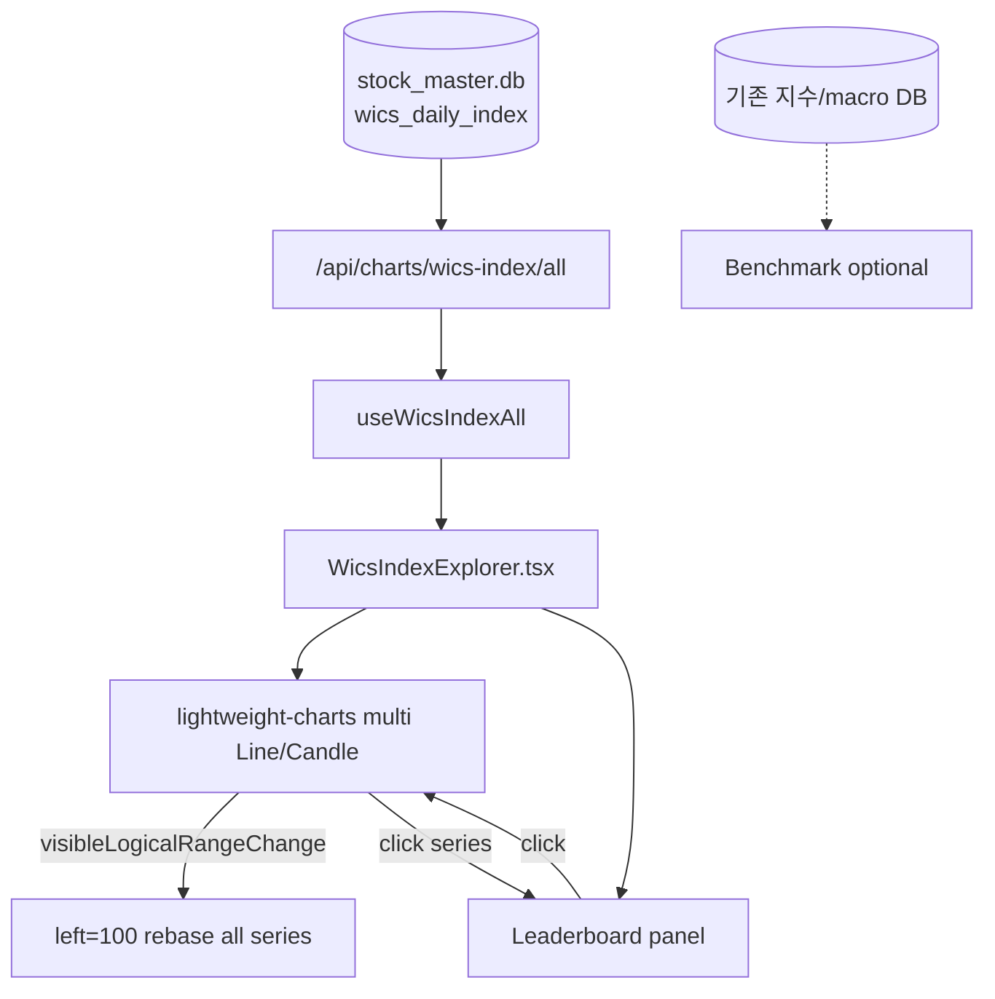

# Design: WICS Index Explorer (주도섹터 탐색 탭)

> 전 WICS 오버레이 + visible-range 좌단=100 rebase + Top-N/리더보드로 구간 주도섹터를 찾는 UI/API 설계

관련: [Plan](../../01-plan/features/wics-index-explorer.plan.md) · Producer [screener#228](https://github.com/hermian/screener/issues/228) · Phase1 유지 [mtt-trend#8](https://github.com/hermian/mtt-trend/issues/8)

## Context Anchor

| Dimension | Content |
|-----------|---------|
| WHY | 창을 바꾸며 “이 구간 주도 섹터”를 즉시 비교 |
| WHO | 섹터 모멘텀·로테이션 탐색 사용자 |
| RISK | 79시리즈 렌더/rebase 비용, 스파게티, fetch 폭주 |
| SUCCESS | 좌단 항상 100, Top-N·클릭·리더보드로 주도 식별, 일주월·라인/캔들 |
| SCOPE | `wics_index` 탭, bulk API, `WicsIndexExplorer` 차트, 기존 랭킹 단건 차트 무변경 |

## 1. Architecture



### 역할 분리
| 탭 | 역할 |
|----|------|
| `wics_ranking` | 12m 랭킹 히트맵 + 셀 클릭 **단건** 지수 (기존 유지) |
| `wics_index` | **전 섹터** 구간 상대강도 탐색 (본 설계) |

## 2. Backend

### 2.1 스키마 (읽기 전용, screener 계약)
```
wics_daily_index(date TEXT, WICS TEXT, EW_Index REAL, MC_Index REAL, ...)
```
가중 기본값: **MC_Index** (UI에서 EW 토글 가능).

### 2.2 Endpoints

#### `GET /api/charts/wics-index/all`
| Query | 설명 |
|-------|------|
| `start_date`, `end_date` | YYYY-MM-DD, optional |
| `tf` | `D` \| `W` \| `M` (default `D`) |
| `weight` | `MC` \| `EW` (default `MC`) |

**Response (초안):**
```json
{
  "tf": "D",
  "weight": "MC",
  "sectors": [
    {
      "WICS": "반도체와반도체장비",
      "points": [
        { "time": "2024-01-02", "open": 100.1, "high": 101.0, "low": 99.5, "close": 100.8 }
      ]
    }
  ]
}
```
- `tf=D` 라인 모드에서는 `close`만 채워도 됨 (`open=high=low=close`).
- `tf=W|M`: 일봉 지수를 캘린더/ISO 주로 그룹 → OHLC  
  - open=첫 close, high=max, low=min, close=마지막 close

#### `GET /api/charts/wics-index` (기존)
단건 — 랭킹 탭 전용. 변경 최소화.

#### (선택) `GET /api/charts/wics-index/meta`
`{ sectors: string[], min_date, max_date }`

### 2.3 성능
- 서버는 **절대 레벨**만 반환. rebase는 클라이언트.
- 기본 호출: `end_date=max`, `start_date` = 최근 N봉에 해당하는 날짜 (D:252, W:104, M:60).
- 팬 아웃 시 클라이언트가 인접 구간을 추가 요청해 병합 (중복 date는 덮어쓰기).

## 3. Frontend

### 3.1 네비게이션
- `Sidebar` / `MobileSidebar`: **WICS Index** → `/trend?tab=wics_index`
- `page.tsx`: `activeTab === "wics_index"` 분기, 풀높이 overflow (ranking/chart와 유사)

### 3.2 컴포넌트
| 파일 | 책임 |
|------|------|
| `WicsIndexExplorer.tsx` | 레이아웃: 툴바 + 차트 + 리더보드 |
| `WicsIndexOverlayChart.tsx` | multi-series, rebase, zoom/pan, click fade |
| hooks `useWicsIndexAll` | react-query, 윈도우 병합 |

기존 `WicsIndexChart.tsx`(단건)는 랭킹 패널 전용 — **수정 최소화**.

### 3.3 툴바
- 주기: 일 | 주 | 월
- 타입: 라인 | 캔들
- 가중: MC | EW
- Top-N: 5 (default) / 10 / 전체
- 범례 Toggle
- (선택) 벤치마크 on/off

### 3.4 Rebase 알고리즘 (표시 전용)
visible range의 첫 타임스탬프 `t0`에서 각 시리즈 값 `v0` (캔들이면 open 또는 close — **close 통일** 권장):

\[
v'(t) = \frac{v(t)}{v(t_0)} \times 100
\]

- `v(t_0)` 결측 시 해당 시리즈는 숨기거나 다음 유효봉을 base로 (문서화).
- `subscribeVisibleLogicalRangeChange` → debounce → 전 시리즈 `setData(rebased)`.
- **리더보드 수익률**도 동일 창 기준: \(v'(t_{end}) / 100 - 1\).

### 3.5 상호작용
1. **기본**: Top-N 색상 팔레트 + 라벨; 나머지 `opacity ~0.15` gray
2. **시리즈/리더보드 클릭**: selection set; 선택만 1.0, 비선택 fade; 라벨에 이름+창수익률
3. **⌘/Ctrl+클릭**: multi-select
4. **빈 차트 클릭 / 선택 해제**: Top-N 모드로 복귀
5. 휠/드래그: lightweight-charts 기본 + 데이터 부족 시 fetch

### 3.6 리더보드
- 우측 고정 폭(~220px): 창 수익률 내림차순
- 행: 색점 · 섹터명 · `+12.3%`
- 호버/클릭 ↔ 차트 하이라이트

### 3.7 벤치마크 (권장 Phase)
- KOSPI 종가 시계열 확보 시 동일 rebase로 1선 (흰색/점선)
- 없으면 전 섹터 동일가중 합성: 각일 섹터 close 평균 후 rebase

## 4. UI Layout (스케치)

```
┌─────────────────────────────────────────────────────────────┐
│ [일|주|월] [라인|캔들] [MC|EW] [Top5|10|전체] [범례] [Bench]   │
├──────────────────────────────────────────────┬──────────────┤
│                                              │ Leaderboard  │
│           Overlay chart (left=100)           │ 1. 섹터 +%   │
│           ghost + Top-N / selection          │ 2. ...       │
│                                              │              │
├──────────────────────────────────────────────┴──────────────┤
│ Source: stock_master.db / wics_daily_index · rebase=visible │
└─────────────────────────────────────────────────────────────┘
```

## 5. Testing
- API: tf 집계 OHLC 정합성, 빈 테이블 → empty, weight 필터
- 프론트: rebase 후 첫 포인트≈100; Top-N 정렬; 클릭 fade; 랭킹 탭 단건 회귀 테스트 유지

## 6. 구현 체크리스트
- [ ] API `/wics-index/all` + tests
- [ ] 탭/사이드바
- [ ] Overlay + left=100 rebase
- [ ] Top-N / click fade / legend toggle
- [ ] Leaderboard sync
- [ ] D/W/M × line/candle
- [ ] Windowed fetch on pan
- [ ] Benchmark (optional)
- [ ] `wics_ranking` 회귀 확인
